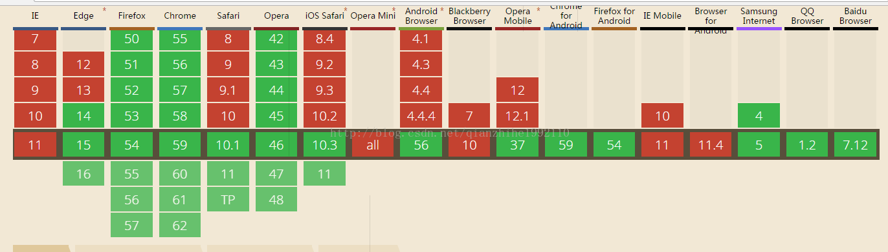

# celelink_shop 壹只桃商城

> 这是一个celelink快链科技团队倾情打造的基于vue+vux+webpack+vue-loader的一款手机端商城实战项目

#下面你可以做如下操作

``` bash
# 安装项目依赖环境
npm install

# 项目本地运行 localhost:8080
npm run dev

# 项目打包
npm run build

# build for production and view the bundle analyzer report
npm run build --report

# 打包问题集合
一、问题与解决办法
  1、路由中伪静态相关问题
    #mode: 'history' //去除#号
    #base: '/shops/' //项目目录的更换
    #assetsPublicPath: '/shops/' //需要配合index.js
    即可但是需要配合后台服务器的伪静态文件.htaccess

  2、本地调试跨域问题
    在本地配置代理目录即可例如本项目
    域名为：http://test.celelink.com/
    路径为：one_mall/backend/h5/
    在index.js中配置代理环境
    context: [ //代理路径
      '/one_mall/backend/h5/' // 代理目录
    ],
    proxypath: 'http://test.celelink.com/'//代理域名

  3、打开新页面是页面自动被滚动到页面底部问题
    const router = new VueRouter({
      routes: [...],
      scrollBehavior (to, from, savedPosition) {
        // return 期望滚动到哪个的位置
        return { x: 0, y: 0 }
      }
    })
    
  4、返回无法传值问题
    //需要返回页以及传值页
      //传递一个map给上一页
      eventBus.$emit('address',id);
      //调用router回退页面
      this.$router.go(-1);
    //待接收页
      //根据地址列表页传参数
      eventBus.$on('address', function(data){
          //接收传递过来的地址参数
          console.log(data)
      }.bind(this));
  5、读取接口时代理的路径问题
    在线api是可以访问的但是本地调试代理出现接口报错404
    问题定位在代理的index文件中
    由于项目不再同一目录中所以需要在代理中添加需要代理的目录

  6、解决移动端低版本手机fetch兼容性问题
    fetch兼容如图
    
    npm install whatwg-fetch -save
    然后在主文件中main.js中引入import 'whatwg-fetch' 目前测试最低版本
    ios    9.3.3
    android 4.4.4

  7、axios封装问题
    在api文件中引入config/index.js
    import request from '../config/index.js';
    api形式如下
    export const getADList = (params) => request.get('../one_mall/backend/h5/personal/getAdList', {
      params
    });
    调用方式如下
    getADList({ pageSize:5}).then(resolved => {
      console.log(resolved)
    })

  8、优化手机端点击延时问题
    运行命令 npm install fastclick --save
    const FastClick = require('fastclick')
    FastClick.attach(document.body)

  9、解决编译后无法跳转的问题
    错误提示 token < 报错的问题
    调试后报错为找不到第几个模块
    问题出在路由中的嵌套一级层级问题

二、常用的一些组件
   1、tabbar  标签的常用属性
   2、安装依赖
    "css-loader": "^0.26.4",
    "node-sass": "^4.5.3",
    "sass": "^1.0.0-beta.2",
    "sass-loader": "^6.0.6",
三、日常笔记

selected   当前悬着项
badge="5"  显示红色小数字
show-dot   红色小圈圈
点击按钮滑动到指定位置ref="scrollerLeft" 给滑动元素增加此监听事件  this.$refs.scrollerLeft.reset({left: 0}) 参数有top,right,bottom,left

动态创建link
var style = document.createElement('link'),
head = document.head || document.getElementsByTagName('head')[0];
style.type = 'text/css'; //这里必须显示设置style元素的type属性为text/css，否则在ie中不起作用
style.href = res.data.edition;
style.rel  = 'stylesheet';
head.appendChild(style); //把创建的style元素插入到head中  

动态创建css方法
function addCSS(cssText) {
  //创建一个style元素   获取head元素
  var style = document.createElement('style'),
    head = document.head || document.getElementsByTagName('head')[0];
  style.type = 'text/css'; //这里必须显示设置style元素的type属性为text/css，否则在ie中不起作用
  if(style.styleSheet) { //IE
    var func = function() {
      try { //防止IE中stylesheet数量超过限制而发生错误
        style.styleSheet.cssText = cssText;
      } catch(e) {

      }
    }
    if(style.styleSheet.disabled) { //如果当前styleSheet还不能用，则放到异步中则行
      setTimeout(func, 10);
    } else {
      func();
    }
  } else { //w3c
    //w3c标准的浏览器中只要创建文本节点插入到style元素中就行了
    var textNode = document.createTextNode(cssText);
    style.appendChild(textNode);
  }
  head.appendChild(style); //把创建的style元素插入到head中   
};
调用
addCSS(subContainer + ':nth-child(' + count + 'n+1){margin-left:0!important}');

Toast的实现在主文件中引入下面插件
import { LoadingPlugin, ToastPlugin } from 'vux'
Vue.use(ToastPlugin)

调用显示
this.$vux.toast.show({
  text: '取消成功'
})
显示文字
this.$vux.toast.text('hello', 'top')
隐藏
this.$vux.toast.hide()

删除字符串的操作-不直接对原数据修改-我的足迹中使用到
方法一
this.ids = this.ids.substr(0, this.ids.length - 1);
方法二
this.ids = this.ids.substring(0, this.ids.length - 1);   
方法三
this.ids = this.ids.substring(0, this.ids.lastIndexOf('#'))

数组删除方法-直接操作原数据
this.list.splice(index,1) //index为数组下标

# 待解决问题
  1、商品价格传递问题
    1.目前通过超链接明文传输
    


需要开发者传入 jsapi_ticket 和 url ，其中 jsapi_ticket 需要通过 http://api.weixin.qq.com/cgi-bin/ticket/getticket?type=jsapi&access_token=ACCESS_TOKEN 接口获取，url 为调用页面的完整 url 。

PHP 部分代码包括了获取 access_token 和 jsapi_ticket 的操作，只需传入 appid 和 appsecret 即可，但要注意如果已有其他业务需要使用 access_token 的话，应修改获取 access_token 部分代码从全局缓存中获取，防止重复获取 access_token ，超过调用频率。

注意事项：
1. jsapi_ticket 的有效期为 7200 秒，开发者必须全局缓存 jsapi_ticket ，防止超过调用频率。

